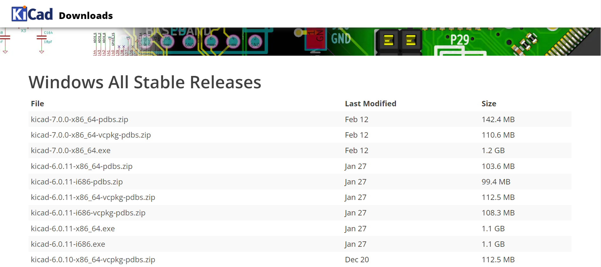
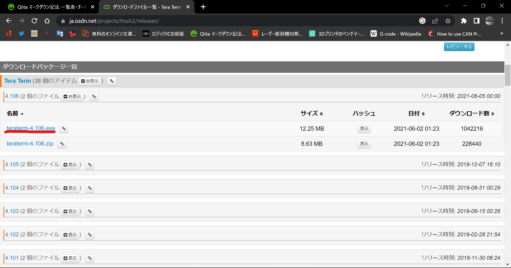
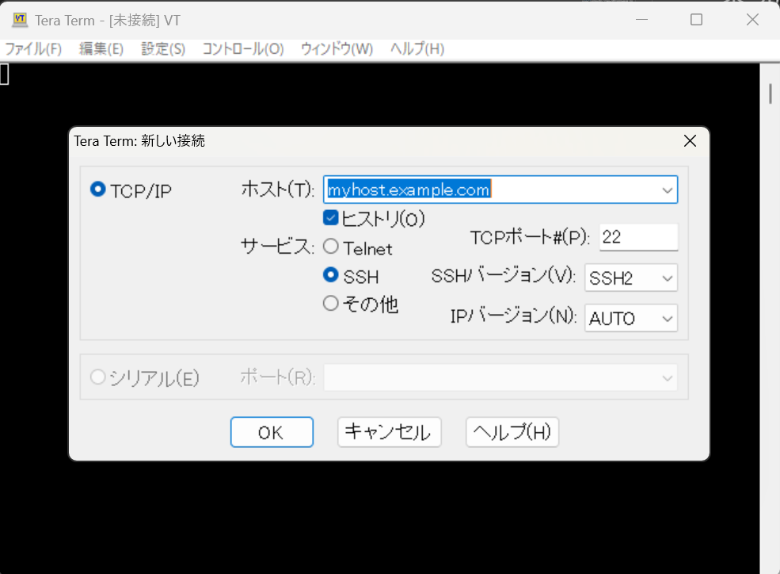
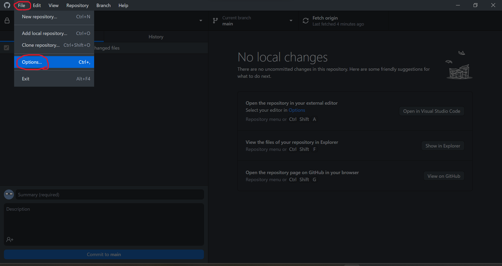
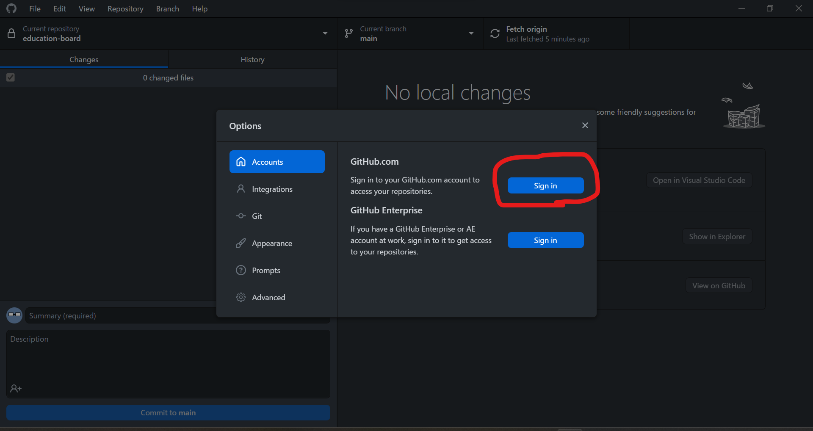

## CubeIDE

CubeIDEはSTMマイコンを開発するのに使用する統合環境です。**大体のことはすでに[phoenix-programのWiki](https://github.com/kiksworks/phoenix-program/wiki/STM32%E3%81%AE%E9%96%8B%E7%99%BA%E7%92%B0%E5%A2%83%E6%A7%8B%E7%AF%89)に書いてあります。**  
ハード班の先輩に聞いて、インストールするバージョンを揃えると、iocファイルなどの設定が効率よく進みます。  

## KiCad

KiCadは回路を設計するのに使用するCADソフトです。  
[KiCadのダウンロードページ](https://www.kicad.org/download/)に飛んで、自分の環境を選択してください。そしてStable Releaseの任意のサーバから最新版のインストーラをダウンロードするか、その下のPrevious Releaseから以前の版をダウンロードしてください。  

.exe版をダウンロードしてください。少々時間はかかりますが。  
インストーラを起動して、インストールを開始してください。基本的に全てNextを押し続ければ大丈夫です。

### 注意

先輩があなたより前のバージョン(Version x.p.qのx)を使っている場合、先輩はあなたの回路をデバッグすることができません。先輩に合わせて以前のバージョンをインストールするのも一つの手ですが、この際、先輩に新しいバージョンをインストールするように促しましょう。

## Tera Term

Tera Termは、USB-SerialやSSH接続を使い、パソコンとマイコン間の通信をすることができるターミナルソフトです。デバッグなど様々な用途に使います。  
[Tera Termのダウンロードページ](https://ja.osdn.net/projects/ttssh2/releases/)に飛んで、インストーラをダウンロードしてください。  
インストーラを起動して、インストールを完了してください。基本的に次への連打で大丈夫です。  
  
この画面が表示されたらインストール完了です。  

## Git

KIKSで生きて行くのにGitは必須です。全てのバージョン管理はGit上で行っているからです。  
Gitを扱えるソフトはいくつかありますが、今回はGitHub Desktopを使用します。GUIで操作できるため非常に使いやすいです。  
ゆくゆくはコマンドでGitを扱う必要性が出てきますが、それは後回しでとりあえずGitの使い方を覚えましょう。

### GitHubアカウントの作成

既にアカウントを持っている人はそれをKIKSで使用してもらっても大丈夫です  
まずは[GitHubのサインアップページ](https://github.com/join)にアクセスし、画面の指示に従ってアカウントを作成してください。名前はKIKSの人が自分だとわかるようなものに設定すると良いでしょう。

### GitHub Desktopのインストール

[GitHub Desktopのダウンロードページ](https://desktop.github.com/)にアクセスし、インストーラーをダウンロードしてください。その後インストーラーを起動してください。  
インストールが完了したら、Fileタブ＞Optionsを選択し、先ほど作成したGitHubアカウントにサインインしてください。

  

以上で大体の環境構築は完了です。必要なものが出てきたらその都度環境構築をしていきましょう。  
