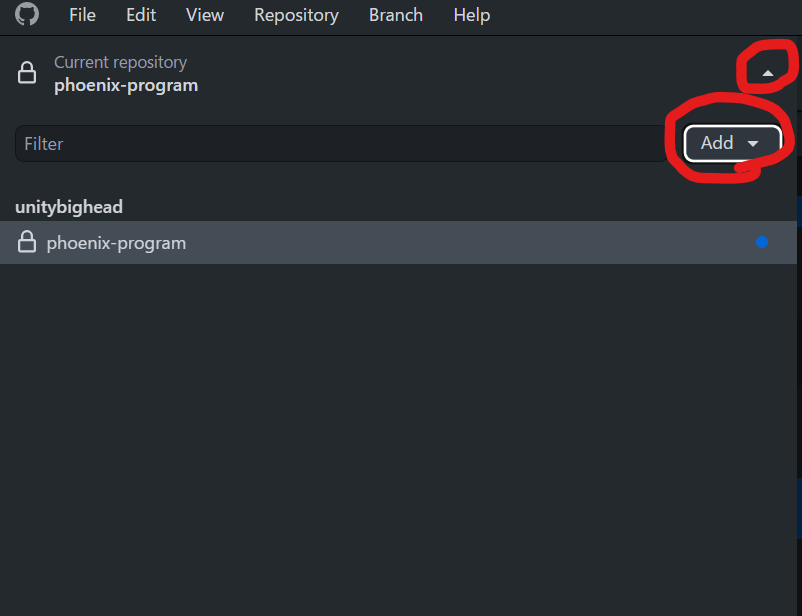

この章ではGitHub上にある教育用基板のデータを取得することを通して**クローン**について学びます。

## 下準備

パソコンの任意の場所にGit用フォルダを作りましょう。このフォルダでGitHubから取得したデータを管理することになります。  

## クローン

Git上のデータは**リポジトリ**と呼ばれる場所に保存されています。このリポジトリのデータを自分の開発環境に丸ごとコピーすることを**クローン**と言います。

GitHub Desktopを起動して左上のCurrent repository > Add > Clone repositoryを選択してください。  
  
そして、検索窓にeduと入力し、kiksworks/education-boardを選択してください。Local pathに先程作成したGit用フォルダを選択し、Cloneボタンを押してください。  
  
するとGit用フォルダの中にeducation-boardというフォルダが作成されます。

education-boardフォルダのEducation_nucleo_pcb > Education_nucleo_pcb > Education_nucleo_pcb.proを開いてみてください。Kicadが起動すれば成功です。  

## 参考リンク

* [【超入門】初心者のためのGitとGitHubの使い方](https://tech-blog.rakus.co.jp/entry/20200529/git#2-Git%E3%81%A8GitHub%E3%82%92%E4%BD%BF%E3%81%A3%E3%81%9F%E3%83%81%E3%83%BC%E3%83%A0%E9%96%8B%E7%99%BA%E3%81%AE%E8%B6%85%E5%85%A5%E9%96%80)
