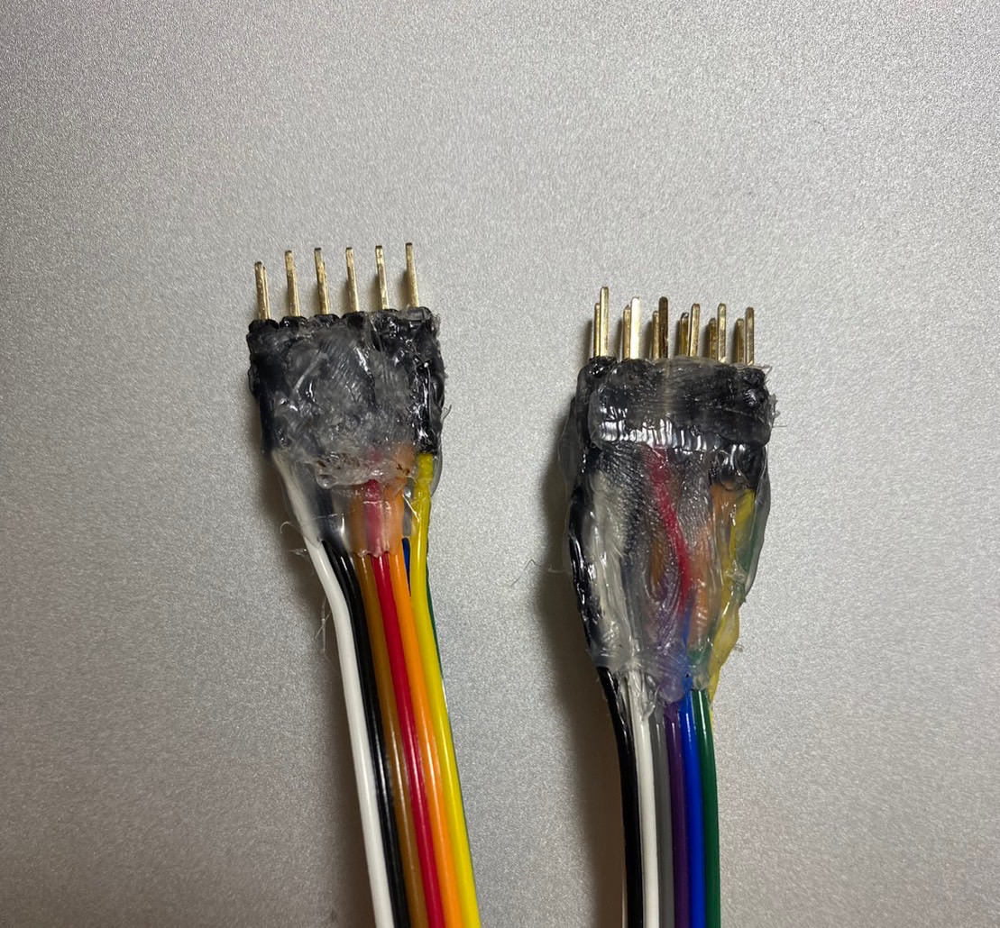
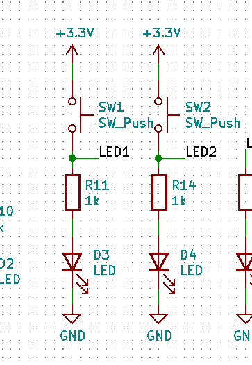
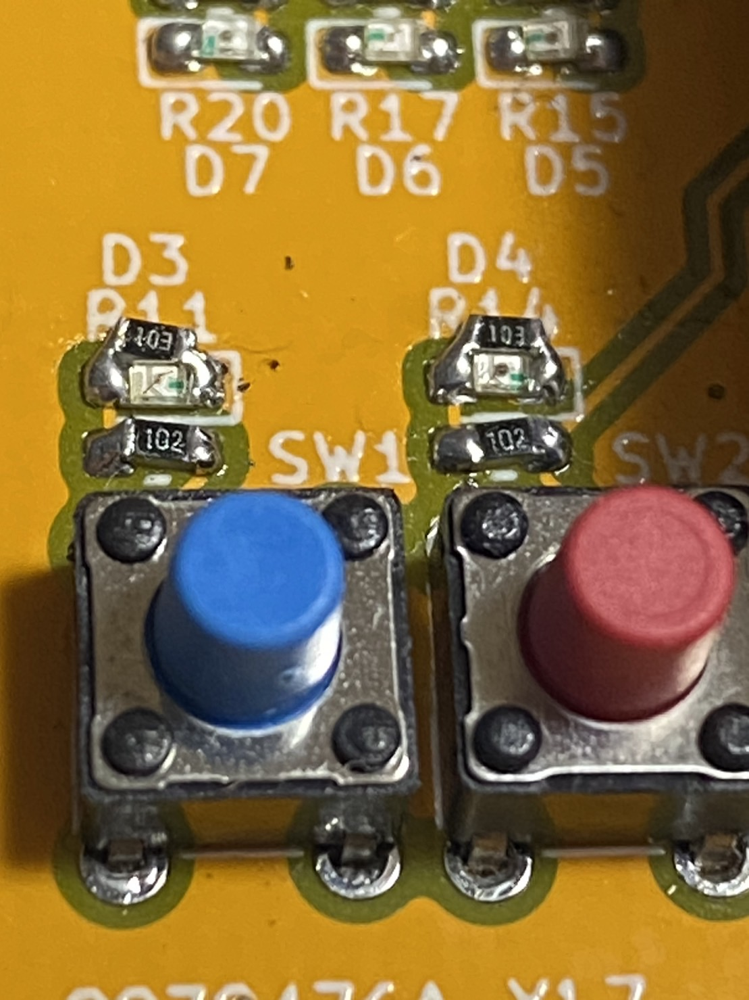
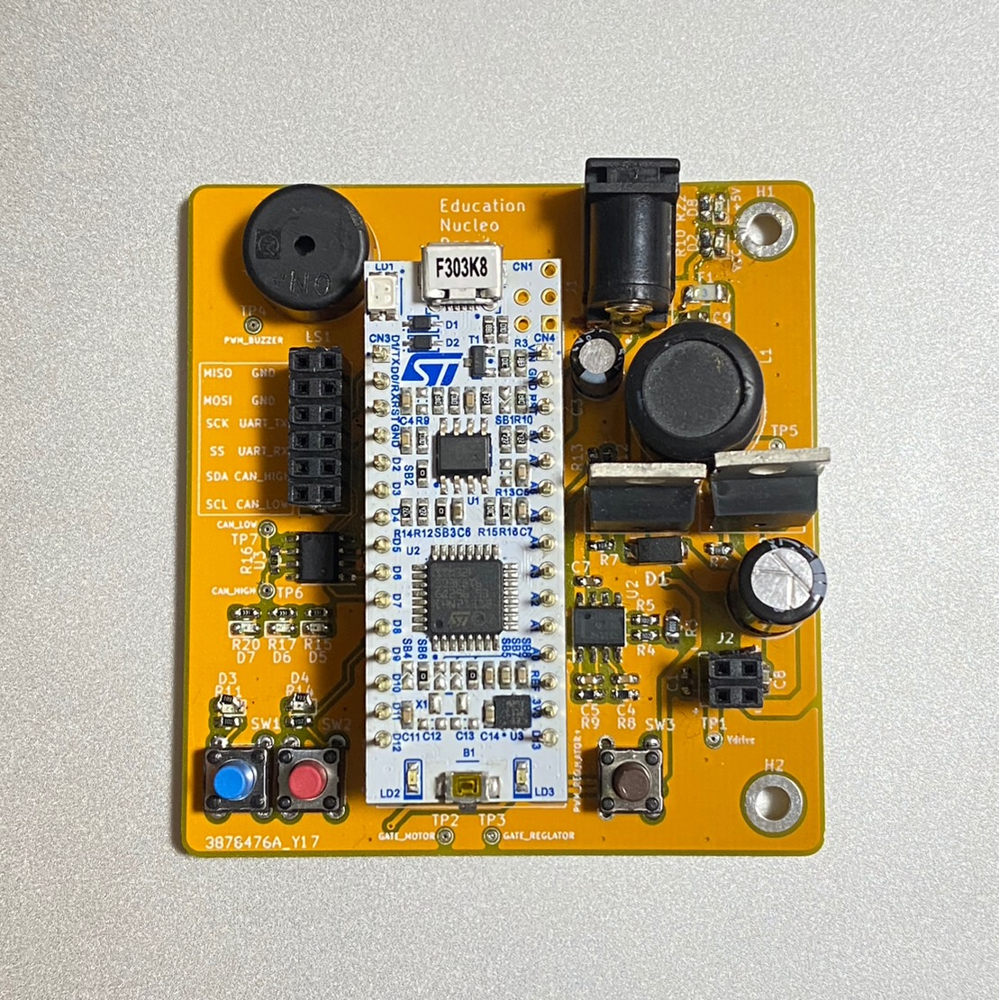

基板に部品を実装しましょう。はんだ付けのやり方などはここで説明するよりもネットで調べたほうが早いしわかりやすいと思います。  
Education_nucleo_pcb > Education_nucleo_pcb > Education_nucleo_pcb.xlsxを開いてください。部品表です。Referenceに示されている部品番号の場所にValueに示されている定数の部品を正しくはんだ付けしてください。  
部品はどこかにまとまっていると思います。先輩に聞いてみてください。もしまとまっていなかったら自分でかき集めてください……  

## ケーブル製作

現設計のケーブルは ~~キチガイ~~ 高難易度仕様となっています。間違いなく教育基板で最も難しい課題です。以下にやり方と完成写真を示すので参考にしてください。

1. ケーブル６本がくっついた状態で長さ20cmほどに切断する(２本)
2. ケーブルの端を全て1.5cmほど割いて、先端の被覆を3mmほど剥く
3. 熱収縮チューブを長さ7mm程度に切断する(12本)
4. 全てのケーブルの端に熱収縮チューブを入れる
5. 2行ピンヘッダを6列に折る(2本)
6. ケーブルの先をピンヘッダの短い側にはんだ付けする。
7. 熱収縮チューブをはんだ付けした部分を隠した状態で収縮させる(はんだごての腹を使うと良い)
8. 形を整え、ケーブルの隙間に入り込むようにグルーガンを流し込む

## リワーク

さて、実はこの基板はこのままでは正しく動作しません。  
  
SW1,2がプルアップもプルダウンもされていないのです。  
修正のために、D3とD4にそれぞれ並列にプルダウン抵抗を挿入しましょう。

完成するとこんな感じになります(はんだ付けが余り上手じゃありませんが……)  
  
出来上がったら基板裏に名前を書いておきましょう。

## 通電前チェック

通電する前に、部品の間違えがないかなどチェックを行いましょう。通電前は事故を起こる前に防げる最後のチャンスです。 　

* 電解コンデンサの向きは正しいですか？（間違えると爆発します！）  
* FET,ICの向きは正しいですか？
* 電源とGNDは導通していませんか？

## 参考リンク

* [【永久保存版】はんだ付けのやり方を解説します【はんだづけの原理, DIP部品, 表面実装】【イチケン電子基礎シリーズ】](https://youtu.be/dQ7AUjb1tkA)  
* [issue/プルダウン抵抗の不足](https://github.com/kiksworks/education-board/issues/2)
