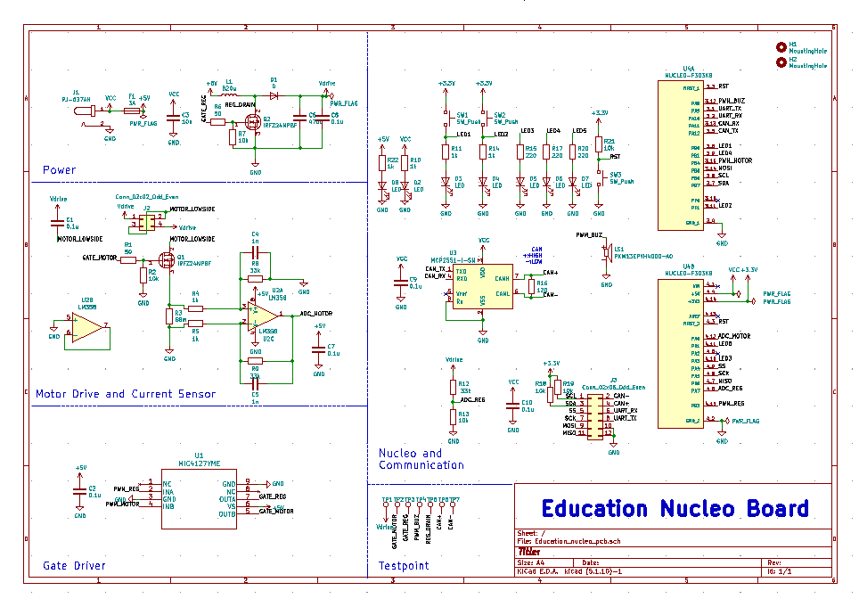
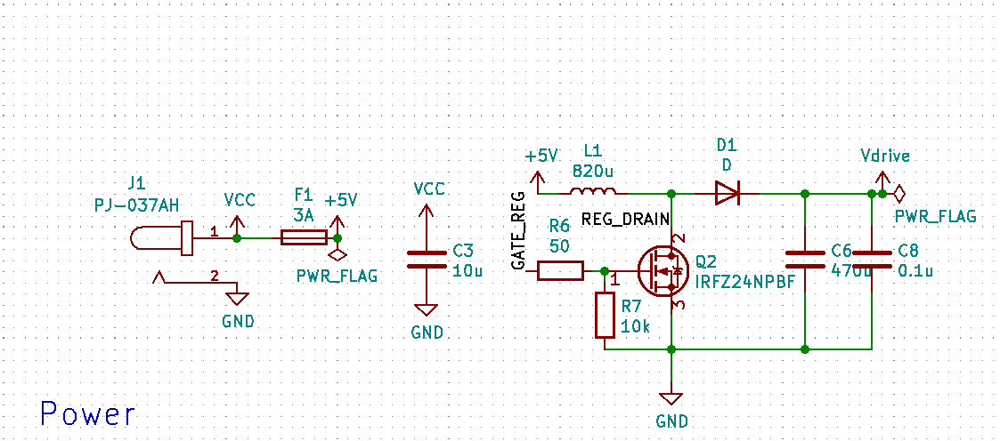
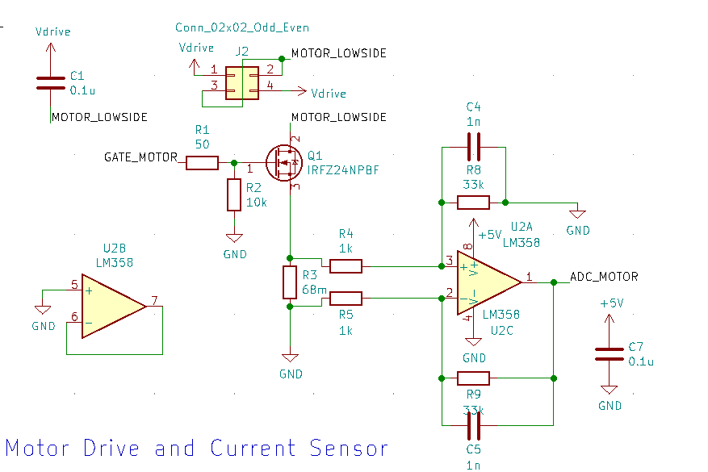
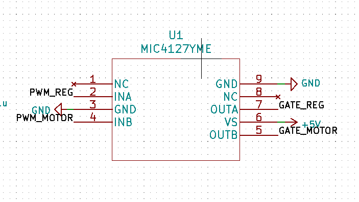
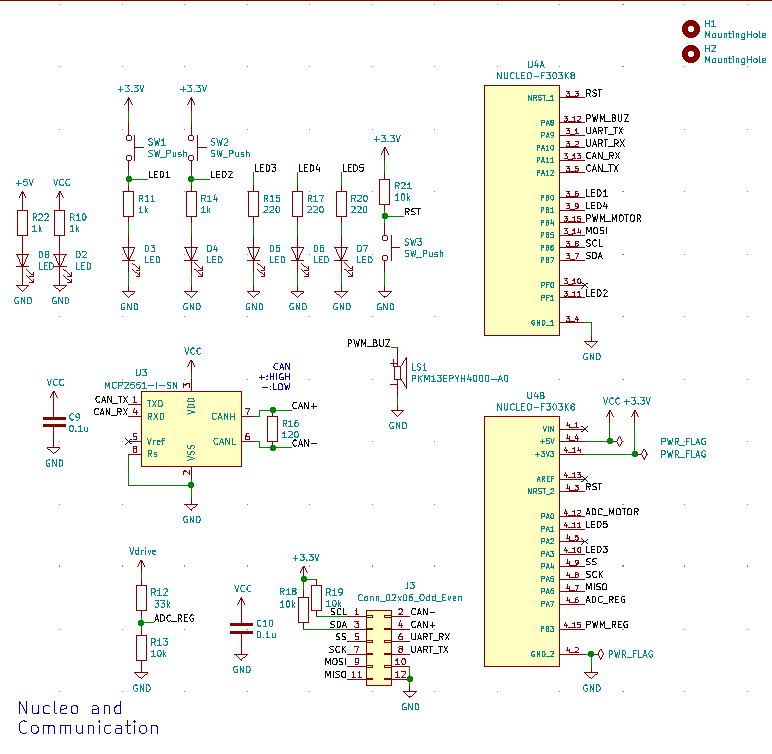
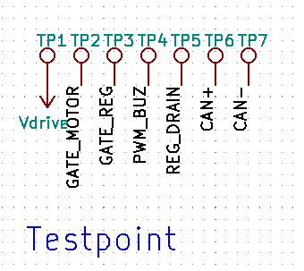

Education-Boardとは、KIKSハード班(主に回路・制御担当)の新人教育用に開発されたマイコン拡張基板です。  
この基板により、表面実装部品の基礎的なはんだ付けスキル、マイコンプログラミングの初歩についての理解をしてもらうことが目的です。  

全体回路図を以下に示します。最新版はmainブランチより直接確認してください。
  
ブロックごとに簡単に解説していきます。  

## 電源

  
DCジャックから5Vの電源を取ることができます。モータ駆動用として、簡単な昇圧回路が組まれています。昇圧回路はマイコンで制御します。

## モータ駆動・電流センサ

  
昇圧した電源を用いてモータを駆動させることができます。
モータはローサイドに配置されたFETを用いて制御できます。制御はマイコンで行います。  
モータに流れる電流は差動増幅回路を用いた電流センサにより検知することができます。ただし精度があまり良くないため、電流制御のような高度な使い方はできません。  

## ゲートドライバ

  
マイコンからの信号でFETを制御します。  
ローサイド駆動専用のICを使用しているためハイサイド駆動できません。新規設計時には注意してください。
リワークするのを忘れずに。  

## マイコン・通信

  
マイコンボードはNucleoF303K8を使用しています。マイコン本体はSTM F303K8T6です。キッカーや拡張基板にも使用されている、使い勝手の良いマイコンです。  
通信は、UART,I2C,SPI,CANに対応しています。UARTは二系統あるため、ケーブルを用いた通信とUSBを介したパソコンとの通信を同時に行うことができます。  
CANトランシーバICはMCP2551を使用しています。  
リワークするのを忘れずに。  

## テストポイント

  
基板の各所にテストポイントを設けることで、テスターやオシロスコープを用いたデバッグ作業がやりやすくなります。みなさんが基板を設計するときには忘れずにつけておきましょう。
